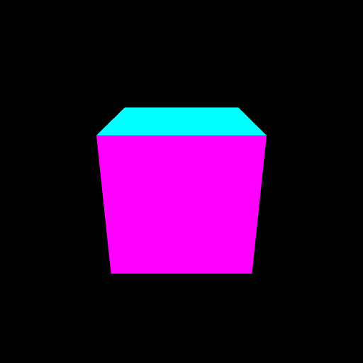

# 透視変換
3Dのモデルを表示してみます。

https://webglstudy.github.io/05_projection/

# 課題
次の問題に挑戦してみてください。

- 物体の動きを変えてみよう

# 課題の進め方
次のように課題を解いてみてください。

- プロジェクトをforkします
- GitHub Pages の機能を使って、ホームページを立ち上げます
- 問題を解きます
- GitHub Pages で正答したか確認しましょう
